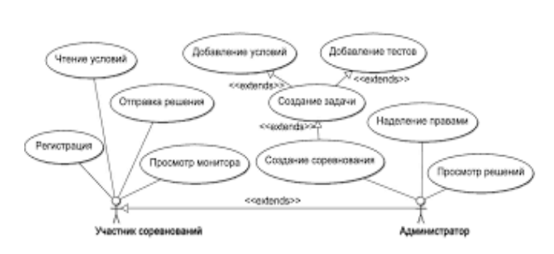
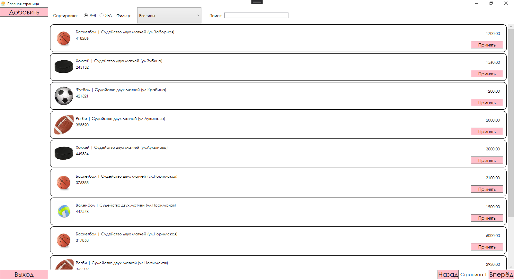
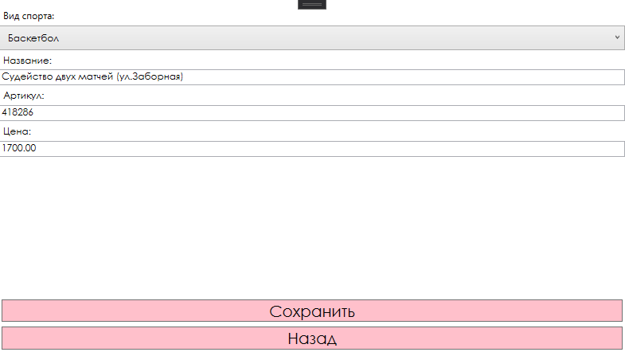

<table style="width: 100%;">
  <tr>
    <td style="text-align: center; border: none;"> 
        Министерство образования и науки РФ <br/>
        ГБПОУ РМЭ "Йошкар-Олинский Технологический колледж 
    </td>
  </tr>
  <tr>
    <td style="text-align: center; border: none; height: 45em;">
        <h2>
            Курсовой проект <br/>
            "Проектирование и разработка информационных систем" <br/>
            группа И-41
        <h2>
    </td>
  </tr>
  <tr>
    <td style="text-align: right; border: none; height: 20em;">
        <div style="float: right;" align="left">
            <b>Разработал</b>: <br/>
            Ярандайкин Андрей Геннадьевич  <br/>
        </div>
    </td>
  </tr>
  <tr>
    <td style="text-align: center; border: none; height: 1em;">
        г.Йошкар-Ола, 2021
    </td>
  </tr>
</table>

<div style="page-break-after: always;"></div>

# Содержание

* [Введение](#Введение)
* [Структурный системный анализ](#Структурный-системный-анализ)
* [Описание предметной области](#Описание-предметной-области)
* [Разработка функциональной модели информационной системы](#Разработка-функциональной-модели-информационной-системы)
* [Разработка и реализация проекта базы данных](#Разработка-и-реализация-проекта-базы-данных)
* [Программирование C#](#Программирование-C#)
* [Заключение](#Заключение)

# Введение

Для успешного и эффективного функционирования практически
любой системы необходимы ведение контроля, анализа и внедрение
автоматизации для отдельных процессов или системы в целом.

Автоматизация позволяет повысить производительность и качество
системы, оптимизировать процессыуправления, снизить затраты.

Целью данной курсовой работы является проектирование
информационной системы сети компьютерного оборудования, которая
позволила бы значительно улучшить качество обслуживания клиентов и
упростить процессы оформления продаж компьютерных оборудований, а
также достичь максимального результата работы сети магазинов
компьютерного оборудования.

Для описания предметной области и проектируемой системы будем
использовать диаграммы UML. Язык моделирования UML предоставляет
выразительные средства для создания визуальных моделей и обладает
рядом значимых преимуществ:

• UML объектно-ориентирован, в результате чего методы
описания результатов анализа и проектирования семантически близки к
методам программирования на современных объектно-ориентированных
языках;

• UML позволяет описать систему практически со всех возможных
точек зрения и разные аспекты поведения системы;

• Диаграммы UML сравнительно просты для чтения после
быстрого ознакомления с его синтаксисом;

UML получил широкое распространение и динамично развивается
Актуальность исследования состоит в необходимости определения
особенностей организации судейства спортивных соревнований по легкой
атлетике.

# Структурный системный анализ

В современном обществе информация стала полноценнымресурсом
производства, важным элементом социальной и политической жизниобщества.

Качество информации определяет качество управления.
 В последнее время все больше предприятий сталкиваются с проблемой улучшения управляемости
компании:

 улучшение контроля иускорение бизнес-процессов, улучшение
возможности их отслеживания, оптимизация рабочего времени, экономия
трудозатрат, повышение производительности труда и так далее.

Единственным способом реализации подобных задач является внедрение информационной
системы. Применение современных информационных технологий имеет
важное значение для оптимизации внутренних процессов организации,
оперативного доведения информации до исполнителей, улучшения
взаимодействия подразделений и отдельных исполнителей в процессе работы
с документами, контроля исполнения документов и поручений, поиска
информации и определения стадии исполнения документов и их
местонахождения, то есть, в конечном счете, способствует болееоперативному
и качественному решению вопросов, которым посвящены документы.
 Главное при этом - улучшение взаимодействия всех подразделений организации,
повышение управляемости, а также достижение более высокой оперативности
в работе.

Актуальность темы определяется тем, что информационные системы
составляют в настоящее время основу компьютерного обеспечения
информационных процессов, входящих практически во все сферы
человеческой деятельности автоматизировать процесс ведения документации
и отчетности.

Данная информационная система предназначена для хранения
информации о участниках, выступающих на соревнованиях, судей и тренеров
с возможностью внесения данных, выборки и изменения данных, вывода 
информации в необходимом формате.

Объект исследования: спортивные соревнования по легкой атлетике.

Предмет исследования: особенности организации судейства спортивных
соревнований по легкой атлетике.

Структура работы и содержание курсовой работы:

Курсовая работа состоит из введения, 2 глав, заключения и списка
литературы.
В работе использовано 12 источников научно-методической
литературы.

Предмет исследования: информационная система,автоматизирующая
проведение соревнований.

В соответствии с поставленной целью в проекте определеныследующие
задачи исследования:

1. На основе теоретического анализа литературы и Internet-источников
произвести анализ предметной области «Проведение соревнований».

2. Провести функционально-ориентированное

3. Проектирование информационной системы.

4. Разработать инфологическую модель информационной системы.

5. Спроектировать логическую структуру информационной системы.

6. Разработать физическую структуру информационной системы.

7. Разработать запросы и отчеты к информационной системе.

8. Разработать интерфейс БД.

9. Создать руководство пользователя. Структура проекта соответствует логике
исследования включает в себя введение, основную часть, заключение,
список

# Описание предметной области

При разработке информационной системы «Проведение спортивных
соревнований» было проведено обследование деятельности спортсменов по
следующим источникам:

• были предоставлены необходимые нормативные документы по
правилам доставки техники и прочего для различных видов спорта;

• журнал, содержащий условия проведения соревнований, а также
сведения о самих соревнований

• литература и Internet-источники, описывающие работу судей и
участников.

Таким образом, в результате обследования предметной области были
определены следующие входные данные:

• информация о участниках,

• информация о документах,

• информация о результатах,

• информация об условиях проведения соревнований.

К выходным данным относятся отчеты об результатах выступления,
нарушений и т.д.

Для создания информационной модели магазина необходимо осуществить
формальное описание его работы. Изучение руководящих документов
является первым шагом в изучении процессов работы магазина.
 Затем, на основе эталонных знаний, исследуется реальная работа директора магазина и
сравнивается с указанием руководящих документов.
 Многократное изучение руководящих документов, периодическое наблюдение за реальными
действиями директора и комментарии этого работника позволяют получить
знания о функционировании работы магазина, разработать модели.

Целью решения данной задачи является сведение к минимумуработы
директора магазина с бумажными носителями, что ускорит процесс обработки
поступающей информации, сократив время ожидания для приёма товаров от
поставщиков, исключит возможную путаницу информации.

#Разработка функциональной модели информационной системы

Проектирование информационной системы «Проведение спортивных
соревнований» начинается с этапа построения бизнес-процессов.

Для описания бизнес-процессов, подлежащих учету в информационной
системе «Проведение спортивных соревнований», используется
функциональное моделирование.

Любое действие может быть декомпозировано, т.е. разложено на более
мелкие, которые, в свою очередь могут быть декомпозированы, и т.д. до
уровня разумной достаточности.

Диаграмма вариантов использования в UML — диаграмма, отражающая
отношения между акторами и прецедентами и являющаяся составной частью
модели прецедентов, позволяющей описать систему на концептуальном
уровне.

Основное назначение диаграммы — описание функциональности и
поведения, позволяющее заказчику, конечному разработчику и пользователю
совместно обсуждать проектируемую или существующую систему.

При моделировании системы с помощью диаграммы прецедентов
системный аналитик стремится:

• чётко отделить систему от её окружения;

• определить действующих лиц (акторов), их взаимодействие с системой
и ожидаемую функциональность системы;

• определить в глоссарии предметной области понятия, относящиеся к
детальному описанию функциональности системы (то есть
прецедентов).

Работа над диаграммой может начаться с текстового описания, полученного
при работе с заказчиком. При этом нефункциональные требования (например,
конкретный язык или система программирования) при составлении модели
прецедентов опускаются (для них составляется другой документ).

Диаграмма последовательности (англ. sequence diagram) — UMLдиаграмма, на которой для некоторого набора объектов на единой временной
оси показан жизненный цикл объекта (создание-деятельность-уничтожение
некой сущности) и взаимодействие актеров (действующих лиц)
информационной системы в рамках прецедента.

Основными элементами диаграммы последовательности являются
обозначения объектов (прямоугольники с названиями объектов),
вертикальные «линии жизни» (англ. lifeline), отображающие течениевремени,
прямоугольники, отражающие деятельность объекта или исполнение им
определенной функции (прямоугольники на пунктирной «линии жизни»), и
стрелки, показывающие обмен сигналами или сообщениями между
объектами.

#### Диаграмма UseCase:


# Разработка и реализация проекта базы данных

ER-модель (от англ. Entity-Relationship model, модель «сущность —
связь») — модель данных, позволяющая описывать концептуальные схемы
предметной области.

ER-модель используется при высокоуровневом (концептуальном)
проектировании баз данных. С её помощью можно выделить ключевые
сущности и обозначить связи, которые могутустанавливаться между этими
сущностями.

Во время проектирования баз данных происходит преобразование
схемы, созданной на основе ER-модели, в конкретную схему базы данных на
основе выбранной модели данных (реляционной, объектной, сетевой или др.).

ER-модель представляет собой формальную конструкцию, которая сама
посебе не предписывает никаких графических средств её визуализации.
 В качестве стандартной графической нотации, с помощью которой можно
визуализировать ER-модель, была предложена диаграмма «сущность-связь»
(англ. Entity-Relationship diagram, ERD, ER-диаграмма).

Понятия «ER-модель» и «ER-диаграмма» часто не различают, хотя для
визуализации ER-моделей могут быть использованы и другие графические
нотации, либо визуализация может вообще не применяться (например,
использоваться текстовое описание).


#### ERD:


# Программирование C#

#### Главная страница приложения:


##### Код разметки окна:
```xml
<Grid>
        <Grid.ColumnDefinitions>
            <ColumnDefinition Width="150"/>
            <ColumnDefinition Width="*"/>
        </Grid.ColumnDefinitions>

        <StackPanel 
            Orientation="Vertical"
            VerticalAlignment="Top"
            Width="150">
            <Button 
                x:Name="AddButton"
                Content="Добавить"
                Click="AddButton_Click"
                VerticalAlignment="Top"
                Background="Pink"
                FontSize="20"
                FontFamily="Century Gothic"
                Cursor="Hand"/>
        </StackPanel>
        <Button  
            x:Name="Exit" 
            Content="Выход" 
            Click="Exit_Click" 
            VerticalAlignment="Bottom"
            Background="Pink"
            FontSize="20"
            FontFamily="Century Gothic"
            Cursor="Hand"/>

        <Grid Grid.Column="1">
            <Grid.RowDefinitions>
                <RowDefinition Height="auto"/>
                <RowDefinition Height="*"/>
                <RowDefinition Height="auto"/>
            </Grid.RowDefinitions>

            <WrapPanel 
                Orientation="Horizontal"
                ItemHeight="50">

                <Label 
                    Content="Сортировка: "
                    Margin="10,0,10,0"
                    VerticalAlignment="Center"
                    FontFamily="Century Gothic"/>

                <RadioButton
                    GroupName="Rooms"
                    Tag="1"
                    Content="А-Я"
                    IsChecked="True"
                    Checked="RadioButton_Checked"
                    VerticalAlignment="Center"
                    Margin="0 0 10 0"/>
                <RadioButton
                    GroupName="Rooms"
                    Tag="2"
                    Content="Я-А"
                    Checked="RadioButton_Checked"
                    VerticalAlignment="Center"/>

                <Label 
                    Content="Фильтр: "
                    Margin="10,0,10,0"
                    VerticalAlignment="Center"
                    FontFamily="Century Gothic"/>

                <ComboBox
                    x:Name="FilterTypeComboBox"
                    SelectedIndex="0"
                    VerticalContentAlignment="Center"
                    MinWidth="200"
                    MinHeight="10"
                    SelectionChanged="FilterTypeComboBox_SelectionChanged"
                    ItemsSource="{Binding ProductTypeList}">
                    <ComboBox.ItemTemplate>
                        <DataTemplate>
                            <TextBlock Text="{Binding Title}"/>
                        </DataTemplate>
                    </ComboBox.ItemTemplate>
                </ComboBox>


                <Label 
                    Margin="20 0 0 0"
                    Content="Поиск:" 
                    VerticalAlignment="Center"
                    FontFamily="Century Gothic"/>
                <TextBox
                    Width="200"
                    VerticalAlignment="Center"
                    x:Name="SearchFilterTextBox" 
                    KeyUp="SearchFilter_KeyUp"
                    FontFamily="Century Gothic"
                    BorderThickness="2"/>
            </WrapPanel>

            <ListView
                Grid.Row="1"
                ItemsSource="{Binding ProductList}"
                x:Name="ProductListView"
                BorderThickness="0"
                MouseDoubleClick="ProductListView_MouseDoubleClick"
                Cursor="Hand">

                <ListView.ContextMenu>
                    <ContextMenu>
                        <MenuItem Cursor="Hand" FontFamily="Century Gothic" Header="Удалить" x:Name="DeleteButton" Click="DeleteButton_Click"/>
                    </ContextMenu>
                </ListView.ContextMenu>

                <ListView.ItemContainerStyle>
                    <Style TargetType="ListViewItem">
                        <Setter
                            Property="HorizontalContentAlignment"
                            Value="Stretch" />
                    </Style>
                </ListView.ItemContainerStyle>

                <ListView.ItemTemplate>
                    <DataTemplate>
                        <Border 
                            BorderThickness="1" 
                            BorderBrush="Black" 
                            CornerRadius="10">
                            <Grid 
                                Margin="10"
                                HorizontalAlignment="Stretch">
                                <Grid.ColumnDefinitions>
                                    <ColumnDefinition Width="64"/>
                                    <ColumnDefinition Width="*"/>
                                    <ColumnDefinition Width="100"/>
                                </Grid.ColumnDefinitions>

                                <Image
                                    Width="64" 
                                    Height="64"
                                    Source="{Binding Path=ImagePreview}" />

                                <Grid Grid.Column="1" Margin="5">
                                    <Grid.RowDefinitions>
                                        <RowDefinition Height="20"/>
                                        <RowDefinition Height="20"/>
                                        <RowDefinition Height="*"/>
                                    </Grid.RowDefinitions>

                                    <StackPanel Orientation="Horizontal">
                                        <TextBlock Text="{Binding ProductType.Title}" FontFamily="Century Gothic"/>
                                        <TextBlock Text=" | " FontFamily="Century Gothic"/>
                                        <TextBlock Text="{Binding Title}" FontFamily="Century Gothic"/>
                                    </StackPanel>

                                    <TextBlock 
                                        Text="{Binding ArticleNumber}"
                                        Grid.Row="1"
                                        FontFamily="Century Gothic"/>
                                </Grid>

                                <TextBlock 
                                    Text="{Binding MinCostForAgent}"
                                    Grid.Column="2"
                                    HorizontalAlignment="Right"
                                    Margin="10"
                                    FontFamily="Century Gothic"/>

                                <Button 
                                    Grid.Column="2"
                                    x:Name="PrinyatBtn"
                                    Content="Принять" 
                                    Click="PrinyatBtn_Click"
                                    HorizontalAlignment="Stretch"
                                    VerticalAlignment="Bottom"
                                    Background="Pink"
                                    FontSize="14"
                                    FontFamily="Century Gothic"
                                    Cursor="Hand"
                                    Height="23"/>

                            </Grid>
                        </Border>
                    </DataTemplate>
                </ListView.ItemTemplate>

            </ListView>

            <StackPanel
                Grid.Row="2"
                HorizontalAlignment="Right" 
                Orientation="Horizontal">
                <Button 
                    Content="Назад" 
                    Name="PrevPage"
                    Click="PrevPage_Click"
                    Background="Pink"
                    FontSize="20"
                    FontFamily="Century Gothic"
                    Cursor="Hand"/>
                <TextBlock 
                    Text="{Binding CurrentPage, StringFormat=Страница {0}}"
                    VerticalAlignment="Center"
                    Margin="5"
                    FontFamily="Century Gothic"
                    FontSize="14"/>
                <Button
                    Content="Вперёд"
                    Name="NextPage"
                    Click="NextPage_Click"
                    Background="Pink"
                    FontSize="20"
                    FontFamily="Century Gothic"
                    Cursor="Hand"/>
            </StackPanel>
        </Grid>

    </Grid>
```
##### Логика главного окна:

```cs
public partial class Product
    {
        public Uri ImagePreview
        {
            get
            {
                var imageName = Environment.CurrentDirectory + Image ?? "";
                return System.IO.File.Exists(imageName) ? new Uri(imageName) : new Uri("pack://application:,,,/products/picture.png");
            }
        }
    }
    public partial class MainWindow : Window, INotifyPropertyChanged
    {

        private IEnumerable<Product> _ProductList;

        private int _CurrentPage = 1;

        public event PropertyChangedEventHandler PropertyChanged;

        public int CurrentPage
        {
            get
            {
                return _CurrentPage;
            }
            set
            {
                if (value > 0)
                {
                    if ((_ProductList.Count() % 10) == 0)
                    {
                        if (value <= _ProductList.Count() / 10)
                        {
                            _CurrentPage = value;
                            Invalidate();
                        }
                    }
                    else
                    {
                        if (value <= (_ProductList.Count() / 10) + 1)
                        {
                            _CurrentPage = value;
                            Invalidate();
                        }
                    }
                }
            }
        }

        private string _SearchFilter = "";
        public string SearchFilter
        {
            get
            {
                return _SearchFilter;
            }
            set
            {
                _SearchFilter = value;
                if (PropertyChanged != null)
                {
                    PropertyChanged(this, new PropertyChangedEventArgs("ApartmentsList"));
                }
            }
        }

        private void SearchFilter_KeyUp(object sender, KeyEventArgs e)
        {
            SearchFilter = SearchFilterTextBox.Text;
            Invalidate();
        }

        private bool _SortList = true;
        public bool SortList
        {
            get
            {
                return _SortList;
            }
            set
            {
                _SortList = value;
                if (PropertyChanged != null)
                {
                    PropertyChanged(this, new PropertyChangedEventArgs("ProductList"));
                }
            }
        }

        private void RadioButton_Checked(object sender, RoutedEventArgs e)
        {
            SortList = (sender as RadioButton).Tag.ToString() == "1";
        }

        private void Invalidate()
        {
            PropertyChanged?.Invoke(this, new PropertyChangedEventArgs("ProductList"));
            PropertyChanged?.Invoke(this, new PropertyChangedEventArgs("CurrentPage"));
        }

        public IEnumerable<Product> ProductList
        {
            get
            {
                var Result = _ProductList;

                if (_ProductTypeFilterValue > 0)
                    Result = Result.Where(ai => ai.ProductTypeID == _ProductTypeFilterValue);

                if (SearchFilter != "")
                    Result = Result.Where(ai => ai.Title.IndexOf(SearchFilter, StringComparison.OrdinalIgnoreCase) >= 0);

                if (SortList) Result = Result.OrderBy(ai => ai.Title);
                else Result = Result.OrderByDescending(ai => ai.Title);

                return Result.Skip((CurrentPage - 1) * 10).Take(10);


            }
            set
            {
                _ProductList = value;

                if (PropertyChanged != null)
                {
                    PropertyChanged(this, new PropertyChangedEventArgs("ProductList"));
                }
            }
        }

        public IEnumerable<Product> ProductsList
        {
            get
            {
                var Result = _ProductList;

                if (SearchFilter != "")
                    Result = Result.Where(ai => ai.Title.IndexOf(SearchFilter, StringComparison.OrdinalIgnoreCase) >= 0);

                return Result;
            }
            set
            {
                _ProductList = value;
            }
        }

        public List<ProductType> ProductTypeList { get; set; }

        private int _ProductTypeFilterValue = 0;
        public int ProductTypeFilterValue
        {
            get
            {
                return _ProductTypeFilterValue;
            }
            set
            {
                _ProductTypeFilterValue = value;
                if (PropertyChanged != null)
                {
                    PropertyChanged(this, new PropertyChangedEventArgs("ProductList"));
                }
            }
        }
        public MainWindow()
        {
            InitializeComponent();
            DataContext = this;
            ProductList = Core.DB.Product.ToArray();
            ProductTypeList = Core.DB.ProductType.ToList();
            ProductTypeList.Insert(0, new ProductType { Title = "Все типы" });
        }


        private void Exit_Click(object sender, RoutedEventArgs e)
        {
            Application.Current.Shutdown();
        }

        private void PrevPage_Click(object sender, RoutedEventArgs e)
        {
            CurrentPage--;
        }

        private void NextPage_Click(object sender, RoutedEventArgs e)
        {
            CurrentPage++;
        }

        private void AddButton_Click(object sender, RoutedEventArgs e)
        {
            var addWindow = new AEWindow(new Product());
            if (addWindow.ShowDialog() == true)
            {
                ProductList = Core.DB.Product.ToArray();
            }

        }

        private void ProductListView_MouseDoubleClick(object sender, System.Windows.Input.MouseButtonEventArgs e)
        {
            var EditTourWindow = new AEWindow(ProductListView.SelectedItem as Product);
            if (EditTourWindow.ShowDialog() == true)
            {
                ProductList = Core.DB.Product.ToArray();
            }
        }

        private void RefreshButton_Click(object sender, RoutedEventArgs e)
        {
            var w = new MainWindow();
            w.Show();

            this.Close();
        }

        private void DeleteButton_Click(object sender, RoutedEventArgs e)
        {
            var DeleteProduct = ProductListView.SelectedItem as Product;
            try
            {
                Core.DB.Product.Remove(DeleteProduct);
                Core.DB.SaveChanges();

                MessageBox.Show($"Удалено!");

                ProductList = Core.DB.Product.ToArray();

                if (PropertyChanged != null)
                {
                    PropertyChanged(this, new PropertyChangedEventArgs("ProductList"));
                }
            }
            catch { }

        }

        private void FilterTypeComboBox_SelectionChanged(object sender, SelectionChangedEventArgs e)
        {
            ProductTypeFilterValue = (FilterTypeComboBox.SelectedItem as ProductType).ID;
        }

        private void PrinyatBtn_Click(object sender, RoutedEventArgs e)
        {
            MessageBox.Show($"Принято!");
        }
    }
}
```

#### Окно добавления и редактирования:


##### Код разметки окна:
```xml
<Grid>
        <StackPanel>
            <Label Content="Вид спорта:"/>
            <ComboBox
                ItemsSource="{Binding productTypesss}"
                SelectedItem="{Binding CurrentProduct.ProductType}"
                FontFamily="Century Gothic"
                Cursor="Hand">
                <ComboBox.ItemTemplate>
                    <DataTemplate>
                        <Label Cursor="Hand" Content="{Binding Title}" FontFamily="Century Gothic"/>
                    </DataTemplate>
                </ComboBox.ItemTemplate>
            </ComboBox>
            <Label 
                FontFamily="Century Gothic"
                Content="Название:"/>
            <TextBox 
                FontFamily="Century Gothic"
                Height="20"
                Text="{Binding CurrentProduct.Title}"
                Cursor="IBeam"/>
            <Label 
                FontFamily="Century Gothic"
                Content="Артикул:"/>
            <TextBox 
                FontFamily="Century Gothic"
                Height="20" 
                Text="{Binding CurrentProduct.ArticleNumber}"
                Cursor="IBeam"/>
            <Label 
                FontFamily="Century Gothic"
                Content="Цена:"/>
            <TextBox 
                FontFamily="Century Gothic"
                Height="20"
                Text="{Binding CurrentProduct.MinCostForAgent}"
                Cursor="IBeam"/>
        </StackPanel>
        <StackPanel 
                VerticalAlignment="Bottom">

            <Button
                x:Name="SaveButton" 
                Content="Сохранить"
                Click="SaveButton_Click"
                Margin="3"
                Background="Pink"
                FontSize="20"
                FontFamily="Century Gothic"
                Cursor="Hand"/>
            <Button 
                x:Name="BackButton"
                Content="Назад"
                Click="BackButton_Click"
                Margin="3"
                Background="Pink"
                FontSize="20"
                FontFamily="Century Gothic"
                Cursor="Hand"/>
        </StackPanel>
    </Grid>
```
##### Логика данного окна:

```cs
public partial class AEWindow : Window
    {
        public static ayarandaykinEntities DB = new ayarandaykinEntities();
        public Product CurrentProduct { get; set; }
        public IEnumerable<ProductType> productTypesss { get; set; }


        public AEWindow(Product productsss)
        {
            InitializeComponent();
            DataContext = this;
            CurrentProduct = productsss;
            productTypesss = Core.DB.ProductType.ToArray();
        }
        private void SaveButton_Click(object sender, RoutedEventArgs e)
        {
            try
            {
                if (CurrentProduct.ProductType == null)
                    throw new Exception("Не выбран тип");

                if (CurrentProduct.ID == 0)
                    Core.DB.Product.Add(CurrentProduct);

                Core.DB.SaveChanges();

                DialogResult = true;

                MessageBox.Show($"Сохранено");
            }
            catch
            {
                MessageBox.Show($"Ошибка");
            }
        }

        private void BackButton_Click(object sender, RoutedEventArgs e)
        {
            this.Close();
        }
    }
}
```

# Заключение

В ходе выполнения курсового проекта средствами MySQL была разработана информационная система «Соревнований»,
предназначенная для автоматизации работы судей соревнований.

Концептуальная модель данных представлена диаграммой «сущность- связь».

На ее основании разработана логическая структура базы данных, в ходе
реализации которой задействованы механизмы обеспечения целостности
данных.

Создание главной формы доступа к данным позволяет
пользователям легко просматривать, обновлять или анализировать
данные. Разработанное приложение просто в применении и может быть
использовано в любом магазине. 
Формы отображают информацию из таблиц в удобном виде, а такжеслужат для ввода данных в таблицы.
Сопоставление результатов проекта с поставленными задачами
позволяет заключить следующее:

1) На основе теоретического анализа литературы и Internet- источников
произведен анализ предметной области соревнований.

2) Проведено функционально-ориентированное
проектирование информационной системы.

3) Разработана инфологическая модель данных.

4) Спроектирована логическая структура информационной системы.

5) Разработана физическая структура информационной системы.

6) Разработаны запросы, отчеты к информационной системе.

7) Разработан интерфейс БД.

